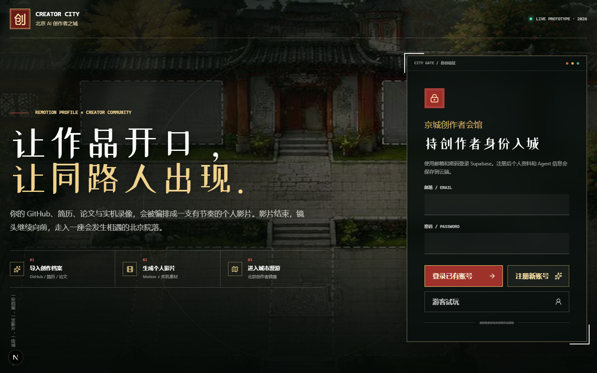

# Creator City · 京城 AI 创作者之城

Creator City 是一个把“个人经历 → 创作者画像 → AI Agent → 城市互动”串成完整体验的创作者社区原型。用户可以导入 GitHub、简历、论文和实机录像，生成个人影像与 Agent 画像，再进入像素化北京院落，在技能集市、模型擂台、创作者茶会和 AI 群聊辩论中探索与协作。

本仓库将两个原本独立的项目保留为两个应用，并通过薄适配层连接：

- `apps/city`：Creator City 主站、身份入口、画像、城市与内容页面。
- `apps/chat-debate`：保留原有调度、提示词、模型提供商、验证、重试和裁判逻辑的 AI 群聊辩论应用。

## 实际运行效果

下面是 Creator City 身份入口的本地运行实拍：



## 核心体验

1. 注册或以游客身份进入。
2. 在 onboarding 中填写创作者信息并上传 GitHub、简历、论文、图片或视频。
3. 生成结构化个人档案和 Agent Persona。
4. 进入京城 AI 创作者之城，浏览项目、技能、模型、榜单、实验室和协作机会。
5. 将个人 Agent 送入 Chat Debate，与预制角色或其他 Agent 进行群聊式讨论。
6. 保存辩论房间、参与者、消息和模型调用记录，刷新后继续查看。

## 功能地图

| 模块 | 说明 |
| --- | --- |
| 身份入口 | 邮箱 / 密码登录、注册与游客试玩 |
| Onboarding | 收集创作者背景、能力、项目、目标和素材 |
| Profile | 展示结构化个人资料与 Agent 画像 |
| Creator Video | 将经历组织为带节奏的个人影像叙事 |
| Pixel City | 北京院落式可探索主场景与设施入口 |
| Projects / Skills | 浏览项目、技能和创作者成果 |
| Intelligence / Lab | 模型、实验和开发测试入口 |
| Collaboration | 协作与社区连接 |
| Chat Debate | 微信群聊式多角色 AI 辩论、验证与裁判 |

## 技术栈

### Creator City

- Next.js 16 + React 19 + TypeScript
- Tailwind CSS 4
- Phaser 4：像素城市场景
- GSAP / Framer Motion / Lenis：动效与滚动
- Remotion：个人影像生成与预览
- Supabase 客户端与本地持久化适配
- Mammoth / unpdf：文档与 PDF 内容提取

### Chat Debate

- React / Vite 前端
- Python API 桥接层
- 多模型 Provider 适配
- 原有调度、回复校验、重试和 Verdict 逻辑

## 快速开始

### 环境要求

- Node.js 20+
- Python 3.10+
- npm

### 安装全部依赖

```bash
git clone https://github.com/xingchenyd/creator-city.git
cd creator-city
npm install
npm run setup
```

`npm run setup` 会分别安装 Creator City、Chat Debate 和 Python API 依赖。

### 配置模型提供商

```bash
cp apps/chat-debate/.env.example apps/chat-debate/.env
```

原后端默认支持 MiMo，也支持 `grok2api` 和 `opencode_go` 等 OpenAI 兼容提供商。通过 `AI_CHAT_PROVIDER` 选择 Provider，并配置对应 API Key。

没有 Provider Key 时，界面会明确显示 AI 服务不可用，不会生成本地占位对话。

### 启动完整项目

```bash
npm run dev
```

默认服务：

- Creator City：`http://localhost:3000`
- Chat Debate：`http://127.0.0.1:5190`
- Chat Debate API：`http://127.0.0.1:8811`

也可以单独启动：

```bash
npm run dev:city
npm run dev:chat
```

## 常用命令

```bash
npm run build       # 构建两个前端应用
npm run typecheck   # 运行 TypeScript 检查
npm run test:chat   # 运行 Chat Debate 对话质量测试
```

Creator City 子应用还提供：

```bash
npm --prefix apps/city run remotion         # 打开 Remotion Studio
npm --prefix apps/city run remotion:still   # 渲染代表帧
npm --prefix apps/city run remotion:render  # 渲染个人影像
```

## 项目结构

```text
creator-city/
├── apps/
│   ├── city/                 # Next.js 主站与像素城市
│   │   ├── src/app/          # 页面与 API
│   │   ├── src/remotion/     # 个人影像 Composition
│   │   └── public/assets/    # 城市、角色、项目与视频素材
│   └── chat-debate/          # 群聊辩论前端与 Python 服务
├── supabase/                 # 数据库 / 迁移相关资源
├── deploy/                   # 部署配置
├── Dockerfile
├── plan.md                   # 数据库与前后端联调方案
└── package.json              # Monorepo 入口命令
```

## 数据与架构边界

- Creator City 只通过适配层接入 Chat Debate，不替换其核心算法。
- 用户密码不得明文保存；会话应通过 `HttpOnly Cookie` 传递。
- 用户上传素材需要服务端鉴权，并保存到持久化目录或对象存储。
- 个人档案、问题答案、Agent Persona、辩论消息和调用量需要可恢复。
- Provider Key 只存在于服务端环境变量，不能下发到浏览器。
- Demo 允许使用 SQLite，但数据库与上传目录必须位于持久化磁盘。

更完整的数据表、接口协议和三小时联调目标见 [`plan.md`](./plan.md)。

## 当前定位

这是一个可运行的产品原型和技术验证仓库，重点验证创作者身份生成、像素城市入口、个人影像和 Agent 辩论的闭环。生产化仍需补充正式的账号安全策略、对象存储、监控、备份、配额管理和部署环境密钥。
